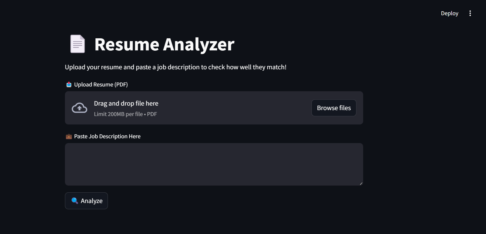
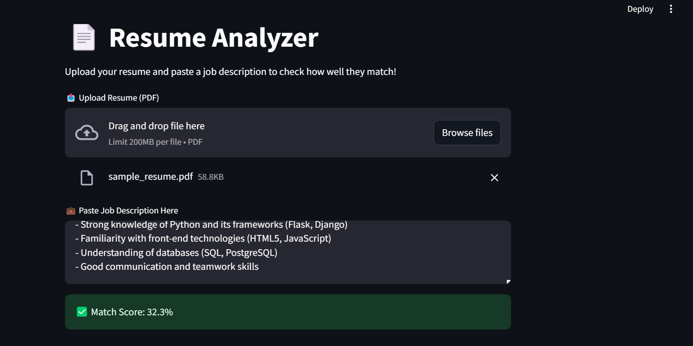

# Resume Analyzer 🎯

A simple Streamlit web application that analyzes resumes against job descriptions and gives a matching score!

## 🚀 Project Overview

This project helps recruiters and job applicants by comparing a candidate's resume to a given job description and providing a match percentage.

## 🧩 Features

- Upload resume in PDF format
- Upload job description in text format
- Get a matching score percentage
- Simple and interactive web interface using Streamlit

## 🚀 Live App

Check out the live Streamlit application here:  
👉 [Resume Analyzer App](https://resumeanalyzer-rbpgrwsrcp7d7zsz5ckw9u.streamlit.app/)

## ⚙️ Installation

1. Clone the repository:
   ```bash
   git clone https://github.com/syedmoaz14/Resume_analyzer.git
   cd Resume_analyzer

2. Install dependencies:
   ```bash
   pip install -r requirements.txt
3. Run application:
   ```bash
   streamlit run app.py

## 📸 Screenshots

| App Interface | Score Output |
|---------------|--------------|
|  |  |


## 📁 Folder Structure
```
📁 Resume_analyzer/
├── app.py                 # Streamlit web app
├── requirements.txt       # Python libraries list
├── README.md              # This file
├── sample_data/           # Sample input files
│   ├── sample_resume.pdf
│   └── sample_jobdesc.pdf
└── screenshots/           # App screenshots
    ├── interface.png
    └── score_output.png
```

